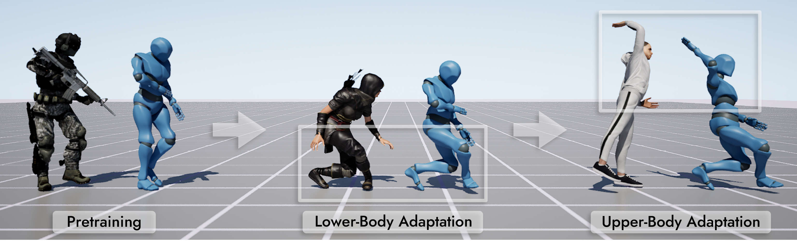
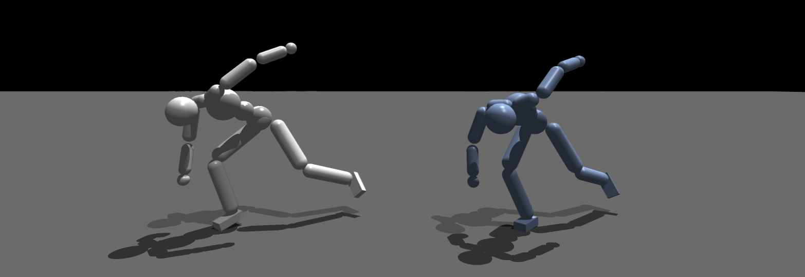
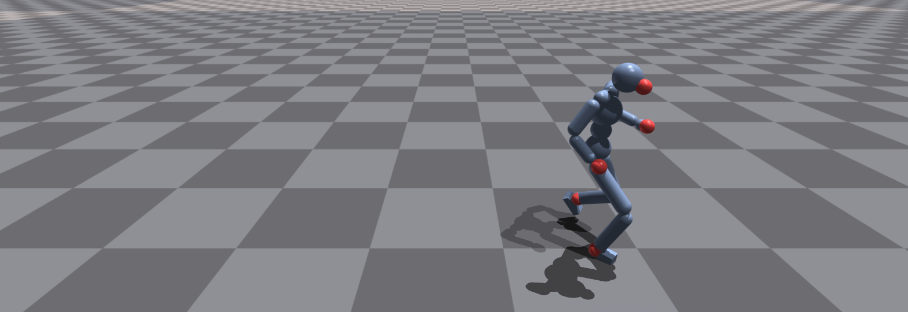
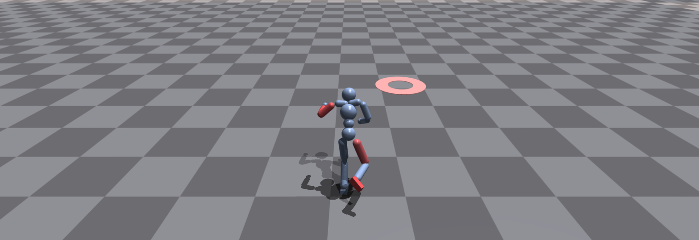

# PLT: Part-Wise Latent Tokens (SIGGRAPH 2025)
<div style="text-align:center">

<br/>
<em>Our novel method with part-wise approach allows physically simulated characters to gradually update part-wise motion priors from the multiple datasets, namely part-wise adaptation.</em>
</div>
<br/>

This is an official implementation for SIGGRAPH 2025 paper titled *"PLT: Part-Wise Latent Tokens as Adaptable Motion Priors for Physically Simulated Characters"*.
We provide codes for all the training and testing environments demonstrated in the main paper.
This code repo is largely based on our pervious project [`hybrid_latent_prior`](https://github.com/jinseokbae/hybrid_latent_prior).
- Paper : [link](https://dl.acm.org/doi/10.1145/3721238.3730637)
- Video : [link](https://www.youtube.com/watch?v=dSHMMwQ9GHE)
- Project Page : [link](https://jinseokbae.github.io/plt)


## 🛠️ Installation
This code is based on [Isaac Gym Preview 4](https://developer.nvidia.com/isaac-gym).
Please run installation code and create a conda environment following the instruction in Isaac Gym Preview 4.
We assume the name of conda environment is `plt` (hybrid latent representation).
Then, run the following script.

```shell
conda activate plt
cd plt
pip install -e .
bash setup_conda_env_extra_cuda117.sh
# When older cuda version is only available
# bash setup_conda_env_extra_cuda111.sh
```

## 💾 Data Preparation
In the paper, we mainly use three datasets: [LaFAN1](https://github.com/ubisoft/ubisoft-laforge-animation-dataset), [AMASS](https://amass.is.tue.mpg.de/), and [Assassin Moves](https://www.reallusion.com/ContentStore/iclone/Pack/assassin_moves/default.html) dataset.
We retargeted each motion capture data to humanoid model in this repo.

For AMASS dataset, we directly utilize [PULSE](https://github.com/ZhengyiLuo/PULSE) codebase, so please refer to the instruction to the original repo.

Due to the license issue, we cannot distribute the whole dataset retargeted to the humanoid. 
We strongly recommend you to retarget original LaFAN1 motions using codes under following our [instruction](isaacgymenvs/tasks/amp/poselib/README.md).
> ⚠️ **Dataset Usage Notice.**<br>
> This project uses the LaFAN1 dataset, which is licensed under the Creative Commons Attribution-NonCommercial-NoDerivatives 4.0 License (CC BY-NC-ND 4.0).
> As such, we do not redistribute any modified or retargeted versions of the dataset.
> Users must download the original data from the official source and run our provided script to generate compatible input.

If you have any problem, please reach us via e-mail.

## 📚 Run with Pretrained Models
We share the pretrained weights for the policies.
Please download from this [Google Drive link](https://drive.google.com/file/d/1LL7ryKVfo1cOdsLXA6uSQvxNk_NClS_t/view?usp=drive_link) and unzip the folder under `isaacgymenvs/`.
We assume all the pretrained polices are located under `isaacgymenvs/pretrained/`.
To run and visualize the result, please run the following commands under `isaacgmynevs/`.
```shell
cd isaacgymenvs/
```
Please note that these commands are using sample reference motions listed in `assets/motions/samples/` for test (unseen motions during the training).

### 🏃‍➡️ Part 1: Imitation Policies
<div style="text-align:center">

<br/>
<em>Visualization of motion imitation. White (left) and blue (right) agents show reference motions and simulated motions, respecitvely.</em>
</div>
<br/>

To train our PLT imitation policy, we employ online distillation suggested by [PULSE](https://arxiv.org/abs/2310.04582).
We empirically found that this strategy allows stable training of complex student policies that are usually employing additional loss terms for regularizing latent space.

**(a) Expert Imitation Policy** 

We provide a simple expert policy trained through [Proximal Policy Optimization](https://arxiv.org/abs/1707.06347) (PPO) and [Adversarial Motion Prior](https://dl.acm.org/doi/10.1145/3450626.3459670).
```shell
python train.py test=True num_envs=1 task=Imitation train=LafanImitation/LafanExpertAMPPPO motion_dataset=samples checkpoint=pretrained/expert_lafan_imitation/nn/expert_lafan_imitation_50000.pth
```

**(b) PLT Imitation Policy**

We share a *PLT-5 model*, where agent has 5 body parts (trunk, left/right arms, left/right legs).
```shell
python train.py test=True num_envs=1 task=Imitation train=LafanImitation/LafanPLTDistill motion_dataset=samples checkpoint=pretrained/plt5_lafan_imitation/nn/plt5_lafan_imitation_25000.pth
```

### 📝 Part 2: Task Policies

**(a) N-body Tracking**

This task is to follow sparse targets, similar to VR tracking scenario.
We share pretrained high-level policies that can track 1, 3 or 5 trackers respectively.
<div style="text-align:center">

<br/>
<em>Visualization of motion tracking. Trackers are indicated with red spheres.</em>
</div>
<br/>

```shell
# Number of Tracker = 1 (Attached to Head)
python train.py test=True num_envs=1 task=Tracking num_track_points=1 train=LafanTasks/LafanTrackLatentMultiDiscretePPO motion_dataset=samples pretrained=pretrained/plt5_lafan_imitation checkpoint=pretrained/plt5_lafan_track1/nn/plt5_lafan_track1_25000.pth

# Number of Tracker = 3 (Attached to Head/Right Hand/Right Foot)
python train.py test=True num_envs=1 task=Tracking num_track_points=3 train=LafanTasks/LafanTrackLatentMultiDiscretePPO motion_dataset=samples pretrained=pretrained/plt5_lafan_imitation checkpoint=pretrained/plt5_lafan_track3/nn/plt5_lafan_track3_25000.pth

# Number of Tracker = 5 (Attached to Head/Hands/Feet)
python train.py test=True num_envs=1 task=Tracking num_track_points=5 train=LafanTasks/LafanTrackLatentMultiDiscretePPO motion_dataset=samples pretrained=pretrained/plt5_lafan_imitation checkpoint=pretrained/plt5_lafan_track5/nn/plt5_lafan_track5_25000.pth
```

**(b) Point-Goal Navigation**

This task is to reach position goal on the ground.
We provide two variants:
- *plain navigation* > standard point-goal navigation scenario.
- *damaged navigation* > randomly weaken arbitrary actuators of the body, and then run *plain navigation*.

<div style="text-align:center">

<br/>
<em>Visualization of point-goal navigation with damaged body setting. Position goal is indicated with the red disk on the ground, while damaged body part is indicated with red color.</em>
</div>
<br/>

```shell
# Plain Navigation
python train.py test=True num_envs=1 task=PointGoalNavigation motion_dataset=samples/amp_humanoid_walk.npy train=LafanTasks/LafanNavLatentMultiDiscretePPO pretrained=pretrained/plt5_lafan_imitation checkpoint=pretrained/plt5_plain_nav/nn/plt5_plain_nav_5000.pth

# Damaged Navigation
python train.py test=True num_envs=1 task=PointGoalNavigation random_effort_cut=True motion_dataset=samples/amp_humanoid_walk.npy train=LafanTasks/LafanNavLatentMultiDiscretePPO pretrained=pretrained/plt5_lafan_imitation checkpoint=pretrained/plt5_damaged_nav/nn/plt5_damaged_nav_10000.pth
```

## Train
To train from scratch, please refer to the following commands.
This code assumes retargeted LaFAN1 dataset is located under `assets/motions`.
> ⚠️ **General Configs.**<br>
> `--headless` > please make sure running training with headless mode.<br>
> `--wandb_activate` > we strongly recommend to use [WanDB](https://wandb.ai/site/) for monitoring training.<br>
> `--experiment` > this will be used as experiment name.<br>


### 🏃‍➡️ Part 1: Imitation Policies

> ⚠️ **Imitation-Learning Configs.**<br>
> `--expert` > please designate directory where expert policy is located. <br>
> `--dof_group` > body-partitioning strategies. select among `['upper-lower', 'right-left']` for PLT-2, or `['trunk-limbs', 'random5']` for PLT-5.<br>
> `--quant_type` > VQ method. options are `basic` (standard VQ) or `rvq` (RVQ). <br>
> `--code_num` > number of codes in a codebook <br>
> `--num_quants` > number of codebooks (only applicable when `--quant_type=rvq`.)<br>

This training command assumes that you have donwnloaded pretrained expert policy under `isaacgymenvs/pretrained/`.

```shell
python train.py headless=True wandb_activate=True task=Imitation train=LafanImitation/LafanPLTDistill expert=pretrained/expert_lafan_imitation experiment=plt5_lafan_imitation dof_group=trunk-limbs quant_type=rvq code_num=1024 num_quants=8
```


### 📝 Part 2: Task Policies

> ⚠️ **Task-Learning Configs.**<br>
> `--entroy_coef` > adjust exploration rate during the training of high-level policy.<br>
> `--num_quants` > as we're using RVQ, set number of codebooks employed from the pretrained VQ structure. 1 is recommended. <br>
> `--num_track_points` > in n-body tracking, set number of trackers (1, 3, 5 are only allowed values).<br>
> `--random_effort_cut` > in point-goal navigation, set `True` to run with damaged setting.<br>

**(a) N-body Tracking**
```shell
# Number of Tracker = 1 (Attached to Head)
python train.py headless=True wandb_activate=True task=Tracking motion_dataset=LaFAN1 train=LafanTasks/LafanTrackLatentMultiDiscretePPO pretrained=pretrained/plt5_lafan_imitation num_track_points=1 experiment=plt5_lafan_track1

# Number of Tracker = 3 (Attached to Head/Right Hand/Right Foot)
python train.py headless=True wandb_activate=True task=Tracking motion_dataset=LaFAN1 train=LafanTasks/LafanTrackLatentMultiDiscretePPO pretrained=pretrained/plt5_lafan_imitation num_track_points=3 experiment=plt5_lafan_track3

# Number of Tracker = 5 (Attached to Head/Hands/Feet)
python train.py headless=True wandb_activate=True task=Tracking motion_dataset=LaFAN1 train=LafanTasks/LafanTrackLatentMultiDiscretePPO pretrained=pretrained/plt5_lafan_imitation num_track_points=5 experiment=plt5_lafan_track5
```

**(b) Point-Goal Navigation**
```shell
# Plain Navigation
python train.py headless=True wandb_activate=True task=PointGoalNavigation train=LafanTasks/LafanNavLatentMultiDiscretePPO pretrained=pretrained/plt5_lafan_imitation experiment=plt5_plain_nav max_iterations=5000

# Damaged Navigation
python train.py headless=True wandb_activate=True task=PointGoalNavigation train=LafanTasks/LafanNavLatentMultiDiscretePPO entropy_coef=0.001 random_effort_cut=True pretrained=pretrained/plt5_lafan_imitation experiment=plt5_plain_nav max_iterations=10000
```


## License
This repository contains three types of code:

1. Code originally authored by NVIDIA (Isaac Gym), licensed under the [BSD 3-Clause License](third_party/LICENSE.txt).

2. PyTorch implementaion on the various vector quantization methods [`vector_quantize_pytorch`](https://github.com/lucidrains/vector-quantize-pytorch), licensed under the [MIT License](https://github.com/lucidrains/vector-quantize-pytorch?tab=MIT-1-ov-file).

3. Code authored by ourselves, licensed under the [MIT License](LICENSE).